# Agentic AI Data Quality & Pipeline Assurance Platform
## Technical Architecture Specification

**Document type:** Technical Architecture  
**Target audience:** Enterprise architects, data engineering leads, platform engineering, AI engineering, security, QA, DevOps, client stakeholders  
**Architecture status:** Target-state architecture with an implementation path from the existing ADE Test Control Tower v0.2  
**Primary objective:** Build a business-aware, evidence-grounded, scale-aware Agentic AI Data Quality Accelerator capable of testing and certifying source-to-target data pipelines across dbt, Airflow, Snowflake, BigQuery, Redshift, and Databricks.

---

# 1. Executive Summary

The platform is an **Agentic AI Data Quality & Pipeline Assurance control plane**.

It is designed to continuously:

1. discover enterprise data assets and pipelines,
2. understand technical and business context,
3. convert business intent into machine-readable quality contracts,
4. analyze transformation logic,
5. generate deterministic quality checks,
6. plan safe and economical execution,
7. execute validation close to the data,
8. reconcile source and target systems,
9. collect immutable execution evidence,
10. diagnose failures using evidence-grounded AI agents,
11. evaluate downstream impact,
12. recommend controlled remediation,
13. re-test,
14. certify trusted data products and pipelines.

The platform must not behave as an opaque AI chatbot.

The governing design principle is:

> **AI determines quality intent and explains evidence. Deterministic systems establish truth.**

The platform also follows four additional non-negotiable principles:

> **No agent action without context.**

> **No material agent conclusion without evidence.**

> **Move the test to the data; do not move terabytes of data into the accelerator.**

> **Deployment must remain portable: the same application architecture must run in standalone Docker, Kubernetes, or cloud/private-VPC environments without changing core product logic.**

---

# 2. Product Scope

## 2.1 Primary capabilities

The target platform provides:

- Business Context Intelligence
- Evidence Intelligence
- Agent grounding and hallucination prevention
- Data asset discovery
- Data product modeling
- Business glossary and quality contracts
- Technical lineage
- Business lineage
- SQL transformation intelligence
- dbt model intelligence
- Airflow DAG intelligence
- Automated quality test generation
- Deterministic quality execution
- Source-to-target reconciliation
- Transformation validation
- Pipeline correctness testing
- Incremental validation
- Schema drift detection
- Statistical quality checks
- Change-aware testing
- Cost-aware execution planning
- Query optimization planning
- Root cause analysis
- Impact analysis
- Incident management
- Controlled remediation
- Continuous certification
- Evidence auditability
- Multi-platform adapter architecture
- Enterprise control-tower UI

## 2.2 Target data platforms

First-class target adapters:

- Snowflake
- Google BigQuery
- Amazon Redshift
- Databricks

Development/demo engine:

- DuckDB

Future adapters:

- Oracle
- SQL Server
- PostgreSQL
- MySQL
- Teradata
- S3
- ADLS
- GCS
- Kafka
- Salesforce
- REST APIs
- files

## 2.3 Pipeline/orchestration systems

First-class:

- Apache Airflow
- dbt Core
- dbt Cloud

Future:

- MWAA
- Google Cloud Composer
- Astronomer
- Databricks Workflows
- Dagster
- Prefect
- Azure Data Factory
- AWS Glue
- Snowflake Tasks

---

# 3. Existing Foundation

The current ADE Test Control Tower v0.2 already provides several useful primitives:

- Python + FastAPI backend
- SQLAlchemy ORM
- SQLite persistence
- real dbt-core execution
- isolated dbt project environments
- dbt Cloud API integration foundation
- real Airflow execution
- Airflow REST API client
- local Airflow instance provisioning
- asynchronous job/DAG orchestration
- dbt artifact parsing
- Airflow task-state collection
- lineage extraction
- run persistence
- raw execution artifact persistence
- DuckDB and Snowflake foundations
- vanilla web UI

These capabilities should be evolved rather than discarded.

The target architecture changes the center of gravity from **execution orchestration** to:

- intelligence,
- contracts,
- evidence,
- quality abstraction,
- scalable execution planning,
- business semantics,
- diagnosis,
- certification.

---

# 4. Architectural Principles

## 4.1 Deterministic truth

LLMs must never determine whether a quality check passed.

LLMs may:

- understand business language,
- infer candidate quality intent,
- map concepts,
- interpret transformation logic,
- propose tests,
- explain failures,
- form RCA hypotheses,
- recommend remediation.

Deterministic engines must evaluate:

- SQL predicates,
- row counts,
- hashes,
- schema checks,
- null rates,
- aggregates,
- reconciliation,
- Airflow state,
- dbt state,
- tolerance thresholds.

## 4.2 Data locality

For large datasets, computation executes in the source or target platform.

The accelerator should receive:

- metrics,
- hashes,
- small statistics,
- query metadata,
- evidence,
- exception rows.

It should not receive:

- billions of raw rows,
- multi-terabyte extracts,
- unrestricted data dumps.

## 4.3 Evidence-first reasoning

Agents produce claims.

Claims must reference evidence.

A claim without sufficient evidence is classified as:

- UNVERIFIED,
- CONFLICTED,
- INSUFFICIENT_EVIDENCE.

## 4.4 Business and technical context are equal citizens

The platform must connect:

- business concept,
- approved definition,
- quality contract,
- source,
- physical column,
- transformation,
- pipeline,
- target,
- consumer.

## 4.5 Adapter independence

Data platforms and pipeline orchestrators are integrations, not the architecture itself.

The core quality model must not depend on Snowflake, Airflow, or dbt.

## 4.6 Cost is part of correctness

An AI-generated quality test that would scan 80 TB unnecessarily is not a valid execution plan.

Every expensive execution must pass a cost and optimization gate.

---

# 5. High-Level Logical Architecture

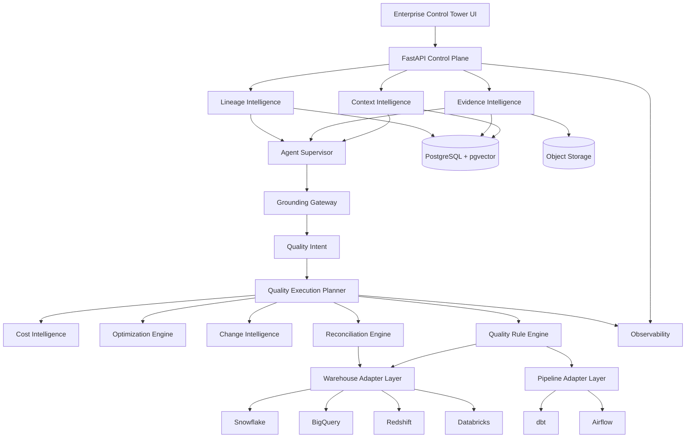

---

# 6. Target Technology Stack

| Layer | Technology |
|---|---|
| Frontend | Next.js + React + TypeScript |
| Styling | Tailwind CSS + design tokens + Radix primitives |
| Data fetching | TanStack Query |
| Large tables | TanStack Table |
| Lineage | React Flow |
| Analytics | Apache ECharts |
| API | Python + FastAPI |
| Validation/contracts | Pydantic v2 |
| ORM | SQLAlchemy 2 |
| Migration | Alembic |
| Operational DB | PostgreSQL |
| Semantic retrieval | pgvector |
| Object evidence | S3-compatible object storage |
| Cache | Redis |
| Durable workflow target | Temporal |
| Runtime workers | Python |
| Container packaging | Docker / OCI-compatible images |
| Standalone runtime | Docker Compose or equivalent container runtime |
| Orchestrated runtime | Kubernetes-compatible distributions |
| Cloud/VPC runtime | AWS, Azure, GCP, private cloud, or customer VPC without provider lock-in |
| Event architecture | Kafka-compatible event backbone |
| SQL parsing | SQLGlot |
| Lineage standard | OpenLineage |
| Statistics | Polars / NumPy / SciPy |
| Telemetry | OpenTelemetry |
| Metrics | Prometheus |
| Ops dashboards | Grafana |
| Error tracking | Sentry |
| Secrets | Provider-neutral secrets abstraction backed by Vault / AWS Secrets Manager / Azure Key Vault / GCP Secret Manager |
| Policy | OPA/Rego or equivalent |
| CI/CD | GitHub Actions or equivalent CI |
| IaC | Terraform with provider-specific modules isolated from core platform |
| Packaging/deploy | OCI images + Docker Compose + Helm/Kubernetes manifests |

---

# 7. System Context

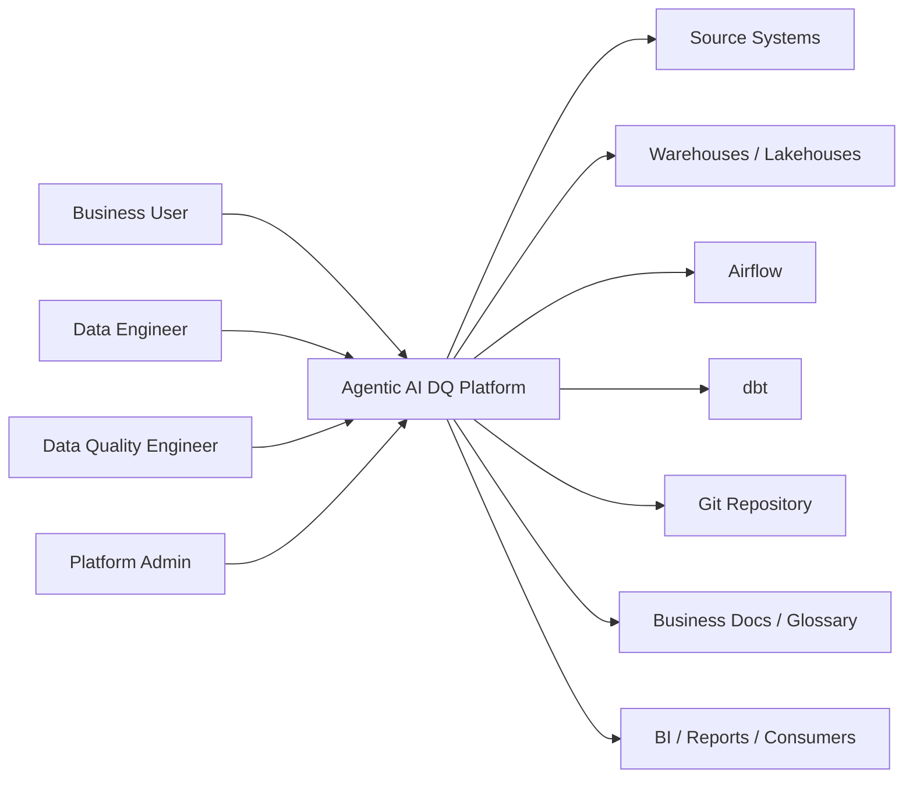

---

# 8. Control Plane Architecture

The FastAPI control plane owns configuration, metadata, coordination, and APIs.

It should not become the heavy compute engine.

## 8.1 Core domains

The control plane manages:

- organizations
- users
- environments
- connections
- datasets
- columns
- pipelines
- tasks
- business concepts
- quality contracts
- quality rules
- test plans
- quality runs
- evidence
- claims
- incidents
- certifications
- costs
- policies
- adapters
- audits

## 8.2 Suggested API groups

```text
/api/v1/connections
/api/v1/data-products
/api/v1/datasets
/api/v1/pipelines
/api/v1/business-context
/api/v1/contracts
/api/v1/quality-rules
/api/v1/quality-plans
/api/v1/quality-runs
/api/v1/reconciliation
/api/v1/evidence
/api/v1/agents
/api/v1/incidents
/api/v1/certifications
/api/v1/costs
/api/v1/lineage
/api/v1/admin
```

---

# 9. Context Intelligence Architecture

Context Intelligence answers:

> What does the business request mean and which approved technical/business information applies?

## 9.1 Context sources

- business glossary
- data contracts
- semantic definitions
- catalogs
- dbt artifacts
- Airflow metadata
- table/column comments
- Git repositories
- source-to-target mappings
- business requirements
- Confluence / SharePoint
- prior incidents
- lineage
- live warehouse metadata

## 9.2 Hybrid retrieval architecture

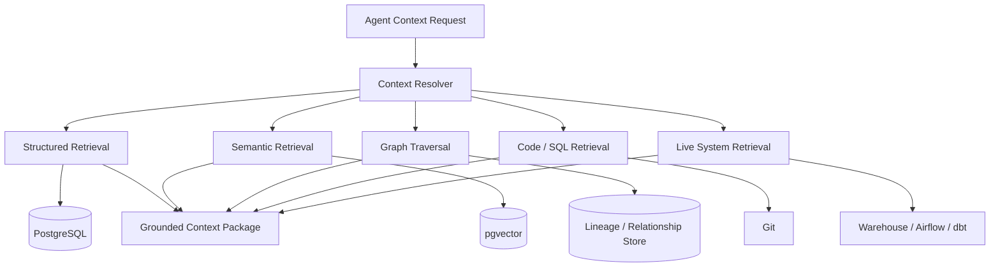

## 9.3 ContextPackage

Example logical structure:

```json
{
  "business_concept": "Net Revenue",
  "approved_definition": "Gross sales minus discounts, refunds and tax",
  "authority": "Finance Data Contract v7",
  "source_datasets": [],
  "target_datasets": [],
  "columns": [],
  "transformations": [],
  "pipelines": [],
  "quality_contracts": [],
  "owners": [],
  "slas": [],
  "conflicts": [],
  "provenance": [],
  "context_status": "SUFFICIENT"
}
```

Every context element requires:

- source
- version
- owner
- authority level
- update timestamp
- approval state
- retrieval timestamp

---

# 10. Evidence Intelligence Architecture

Evidence Intelligence answers:

> What actually happened and what proves it?

## 10.1 Evidence sources

### Warehouse evidence

- query text
- query ID
- row counts
- scan bytes
- aggregate results
- hashes
- exception rows
- schemas
- statistics
- plans
- historical queries

### dbt evidence

- manifest.json
- catalog.json
- run_results.json
- compiled SQL
- model metadata
- test results
- freshness

### Airflow evidence

- DAG run
- task run
- state
- retry
- duration
- logs
- dependencies

### Code evidence

- Git commit
- PR
- diff
- changed SQL
- changed DAG
- configuration change

### Business evidence

- approved contract
- business rule
- source-to-target mapping
- glossary version

## 10.2 Evidence pipeline

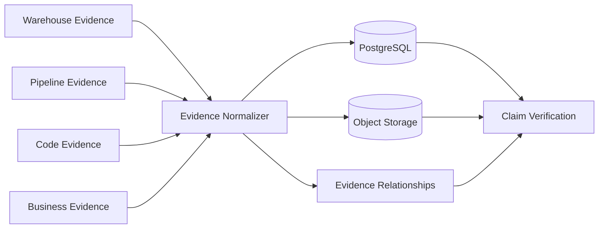

## 10.3 Evidence object

```json
{
  "evidence_id": "EV-12345",
  "type": "ROW_COUNT",
  "source_type": "SNOWFLAKE_QUERY",
  "dataset": "FINANCE.FACT_REVENUE",
  "value": 8422192,
  "query_id": "01abc...",
  "run_id": "QRUN-2001",
  "observed_at": "2026-09-03T20:10:00Z",
  "provenance": {
    "adapter": "snowflake",
    "connection": "prod-finance"
  }
}
```

Large exception sets and artifacts belong in object storage.

---

# 11. Claim-Evidence Grounding Gateway

Agents cannot publish unsupported conclusions as facts.

## 11.1 Claim model

```text
AgentClaim
- claim_id
- claim_type
- statement
- supporting_evidence[]
- contradictory_evidence[]
- context_refs[]
- status
- confidence_class
- generated_by
- created_at
```

## 11.2 Claim statuses

- SUPPORTED
- PARTIALLY_SUPPORTED
- UNVERIFIED
- CONFLICTED
- REJECTED
- UNKNOWN

## 11.3 Grounding rules

```text
Missing required context
    → BLOCK

Deterministic claim without evidence
    → UNVERIFIED

Contradictory evidence exists
    → CONFLICTED

Direct reproducible evidence
    → SUPPORTED
```

LLM output itself must never count as evidence.

---

# 12. Evidence Authority Model

Evidence priority:

## Tier 1 — deterministic system evidence

- SQL output
- query ID
- hashes
- reconciliation
- dbt status
- Airflow task state
- schema metadata

## Tier 2 — approved enterprise metadata

- quality contract
- glossary
- mapping
- certified lineage

## Tier 3 — engineering context

- SQL code
- DAG code
- Git diff
- runbook
- model metadata

## Tier 4 — historical inference

- prior incidents
- anomaly history
- previous RCA

## Tier 5 — generative inference

- LLM hypothesis

A Tier 5 inference cannot override Tier 1 evidence.

---

# 13. Business Quality Contract Architecture

Business users should not need SQL.

Example input:

```text
Business Concept: Net Revenue

Definition:
Gross sales minus discounts, refunds and taxes.

Rules:
Cancelled orders contribute zero.
COMPLETE and SHIPPED orders are recognized.

SLA:
Daily by 6 AM.

Tolerance:
0.1%.

Criticality:
Tier 1.
```

Converted contract:

```yaml
dataset: finance.fact_revenue

business:
  concept: net_revenue
  domain: finance
  criticality: TIER_1

grain:
  - order_id

sla:
  ready_by: "06:00"

rules:
  - id: cancelled_order_zero
    dimension: business_rule

  - id: recognized_status
    dimension: business_rule

  - id: source_target_reconciliation
    dimension: accuracy
    tolerance:
      percentage: 0.001
```

Contracts are:

- versioned
- owned
- approved
- effective-dated
- traceable
- linked to physical datasets

---

# 14. Quality Rule Taxonomy

## 14.1 Schema

- required column
- unexpected column
- type
- length
- precision
- scale
- nullability
- PK
- FK
- drift
- defaults
- partition
- clustering expectations

## 14.2 Completeness

- null rate
- missing records
- missing partitions
- missing dates
- incomplete batches
- source/target completeness
- late-arriving records

## 14.3 Uniqueness

- primary key
- composite key
- duplicate row
- business key
- event duplicate
- replay detection

## 14.4 Validity

- allowed values
- regex
- numeric range
- enum
- date validity
- reference lookup
- currency/country validation

## 14.5 Accuracy

- source-of-truth comparison
- cross-system reconciliation
- calculation validation
- reference/master-data comparison

## 14.6 Consistency

- cross-column
- cross-table
- cross-system
- unit
- currency
- date
- hierarchy

## 14.7 Referential integrity

- missing parent
- orphan
- FK break
- hierarchy break
- dimensional integrity

## 14.8 Timeliness / freshness

- source freshness
- table freshness
- partition freshness
- expected load time
- pipeline latency
- late file/event

## 14.9 Volume

- count
- daily volume
- spike/drop
- partition volume
- historical variance

## 14.10 Distribution

- min/max
- mean
- median
- percentiles
- std deviation
- cardinality
- distinct count
- category distribution
- drift

## 14.11 Anomaly

- z-score
- IQR
- EWMA
- seasonality
- change point
- forecast deviation

## 14.12 Transformation correctness

- CASE
- JOIN
- FILTER
- GROUP BY
- windows
- deduplication
- SCD1
- SCD2
- aggregation
- currency conversion
- timezone
- date derivation
- allocation
- revenue recognition
- lookup
- surrogate key
- pivot/unpivot
- incremental
- CDC

## 14.13 Pipeline correctness

- idempotency
- retries
- exactly-once / at-least-once behavior
- backfill correctness
- incremental correctness
- CDC correctness
- watermark handling
- late-arriving data
- duplicate replay
- checkpoint recovery
- restart
- partial failure
- schema evolution
- data loss after retry

---

# 15. Canonical Quality Rule Model

```yaml
id: QR-1001

dataset: finance.fact_revenue

dimension: accuracy
type: transformation_reconciliation

business_context:
  concept: net_revenue
  contract_id: QC-2026-07

expression:
  target: net_revenue
  formula:
    gross_revenue - discount - refund - tax

grain:
  - order_id

tolerance:
  type: percentage
  value: 0.001

severity: P1

execution_policy:
  prefer_incremental: true
  allow_full_scan: false
  maximum_exception_rows: 1000

evidence:
  retain_metrics: true
  retain_exceptions: true
```

The canonical rule is platform-independent.

---

# 16. Rule Compiler Architecture

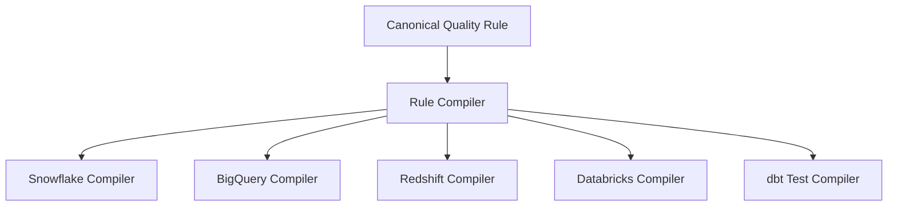

Each compiler must preserve:

- logical rule identity,
- parameterization,
- evidence metadata,
- deterministic semantics.

---

# 17. Data Platform Adapter SDK

Suggested contract:

```python
class DataPlatformAdapter(ABC):

    async def test_connection(self): ...
    async def discover_metadata(self): ...

    async def get_schema(self, object_ref): ...
    async def get_table_stats(self, object_ref): ...
    async def get_partitions(self, object_ref): ...
    async def get_row_count(self, object_ref, predicate=None): ...

    async def execute_query(self, query, policy): ...
    async def explain_query(self, query): ...
    async def estimate_query_cost(self, query): ...
    async def cancel_query(self, query_id): ...

    async def get_query_history(self, object_ref): ...
    async def get_lineage_metadata(self, object_ref): ...
```

## Adapter implementations

- DuckDBAdapter
- SnowflakeAdapter
- BigQueryAdapter
- RedshiftAdapter
- DatabricksAdapter

Future:

- OracleAdapter
- SQLServerAdapter
- PostgreSQLAdapter
- TeradataAdapter

---

# 18. Pipeline Adapter SDK

```python
class PipelineAdapter(ABC):

    async def test_connection(self): ...
    async def discover_pipelines(self): ...
    async def discover_tasks(self, pipeline_id): ...
    async def get_dependencies(self, pipeline_id): ...

    async def trigger_pipeline(self, pipeline_id, params=None): ...
    async def get_run(self, run_id): ...
    async def get_task_states(self, run_id): ...
    async def get_logs(self, run_id, task_id=None): ...

    async def retry_task(self, run_id, task_id): ...
    async def cancel_run(self, run_id): ...
    async def get_schedule(self, pipeline_id): ...
```

Implement first:

- AirflowAdapter
- DbtCoreAdapter
- DbtCloudAdapter

---

# 19. Airflow Integration Architecture

Production mode should connect to existing Airflow rather than requiring an Airflow instance per project.

Supported patterns:

```text
AirflowAdapter
  ├── Self-hosted Airflow
  ├── AWS MWAA
  ├── Cloud Composer
  └── Astronomer
```

The existing local Airflow provisioning mode remains useful for:

- development
- demos
- local certification
- integration tests

Airflow evidence includes:

- DAG state
- task state
- retry count
- duration
- logs
- dependency graph
- schedule
- execution timestamps

---

# 20. dbt Integration Architecture

Support:

```text
DbtAdapter
  ├── dbt Core
  └── dbt Cloud
```

Artifact ingestion:

- manifest.json
- catalog.json
- run_results.json
- compiled SQL
- sources
- models
- tests
- macros
- exposures
- metrics
- semantic models when available

dbt artifacts contribute to:

- lineage
- transformation understanding
- quality coverage
- evidence
- RCA

---

# 21. SQL / Transformation Intelligence

Use SQLGlot to convert SQL into structured transformation metadata.

Example:

```sql
SELECT
    customer_id,
    SUM(
      CASE
        WHEN status IN ('COMPLETE','SHIPPED')
        THEN gross_amount - discount - refund
        ELSE 0
      END
    ) AS net_revenue
FROM orders
GROUP BY customer_id
```

Structured interpretation:

```text
inputs:
- customer_id
- status
- gross_amount
- discount
- refund

outputs:
- customer_id
- net_revenue

operations:
- CASE
- FILTER
- SUBTRACTION
- SUM
- GROUP BY

grain:
- customer_id
```

This structure is fed to agents instead of raw SQL alone.

---

# 22. Agent Architecture

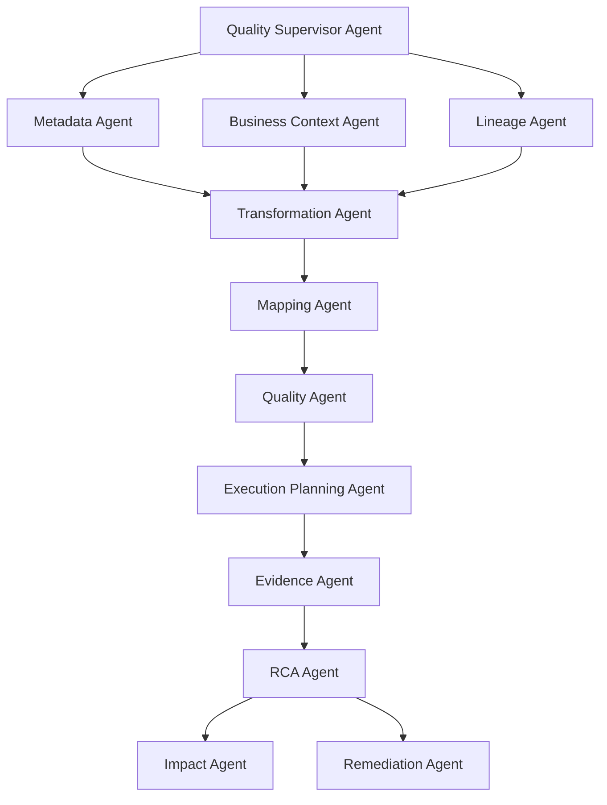

Initial vertical slice should fully implement:

1. Context Agent
2. Transformation Agent
3. Quality Agent
4. Evidence Agent
5. RCA Agent

---

# 23. LLM Gateway Architecture

Do not couple business logic to one AI provider.

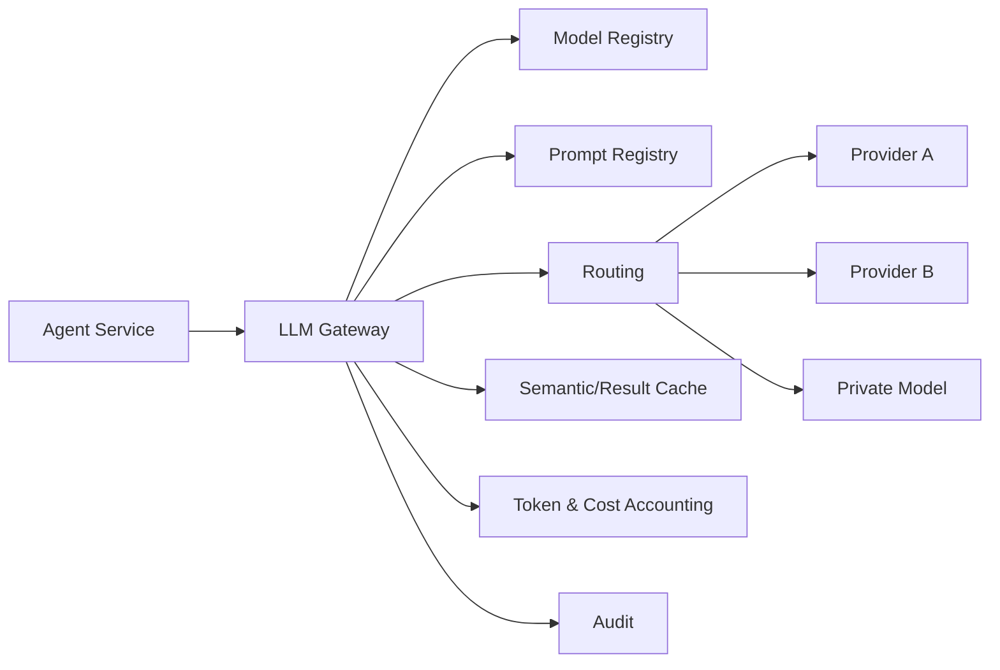

Gateway responsibilities:

- structured outputs
- retries
- timeouts
- caching
- cost tracking
- model routing
- fallback
- prompt versioning
- token accounting
- redaction
- audit
- tool permissions

Use cheaper/smaller models for:

- classification
- summarization
- extraction
- formatting
- simple metadata interpretation

Use stronger reasoning only for:

- ambiguous business context
- complex transformation reasoning
- RCA
- difficult source-target mapping

---

# 24. Quality Execution Planner

The execution planner converts logical quality intent into a safe execution strategy.

Inputs:

- platform
- dataset size
- row estimate
- partition metadata
- clustering
- changed partitions
- last certification
- historical metrics
- rule severity
- business criticality
- SLA
- cost policy
- tolerance
- available compute
- query estimate

Output:

```text
ExecutionPlan
- strategy
- predicates
- partitions
- source queries
- target queries
- expected bytes
- estimated cost
- timeout
- evidence requirements
- fallback strategy
```

---

# 25. Scale Intelligence

Scale strategy should change with dataset size.

| Approximate scale | Preferred strategy |
|---|---|
| 1–10M rows | direct native SQL checks |
| 10–500M | partition + aggregate |
| 500M–5B | incremental + bucket hashes |
| 5B+ | hierarchical bucket/hash reconciliation |
| TB-scale | push-down mandatory |
| 10–100+ TB | change-aware incremental certification |
| PB-scale | distributed native execution + sketches/hashes + selective exact validation |

These are planning guidelines, not hard-coded absolute limits.

---

# 26. Source-to-Target Reconciliation Engine

First-class reconciliation modes:

- schema
- row count
- column count
- aggregate
- key coverage
- null metrics
- distinct counts
- partition metrics
- hash
- bucket hash
- record comparison
- transformation comparison
- business-rule comparison
- CDC comparison
- incremental comparison
- historical snapshot

Example:

```text
Source:
Oracle.ERP.ORDERS

Target:
Snowflake.MART.FACT_ORDERS

Mapping:
ORDER_NUMBER → ORDER_ID
CUSTOMER_NUMBER → CUSTOMER_ID
ORDER_TOTAL → QUANTITY * UNIT_PRICE - DISCOUNT
```

The engine generates source dialect SQL and target dialect SQL independently.

Only small reconciliation outputs move to the control plane.

---

# 27. Hierarchical Hash Reconciliation

For extremely large tables:

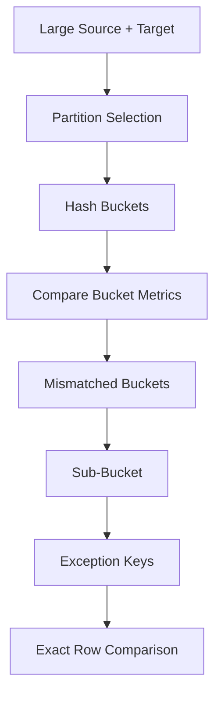

Bucket calculations may include:

- row count
- null count
- sum
- min/max
- deterministic canonical hash

Canonicalization must handle:

- NULL
- decimals
- timestamp timezone
- date
- strings
- booleans
- floating-point precision

---

# 28. Incremental Certification

Persist historical certification state.

Suggested entities:

```text
DQMetricHistory
CertificationBaseline
PartitionCertification
```

Example:

```text
dataset: FACT_ORDER
partition: 2026-09-02
row_count: 482819372
revenue_sum: 8299191010
hash_version: 04
rule_version: QR-102-v3
code_version: abc123
status: CERTIFIED
```

Previously certified partitions need not be reprocessed unless invalidated by:

- source change
- transformation change
- contract change
- schema change
- rule change
- lineage change

---

# 29. Change Intelligence

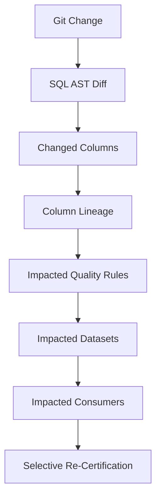

This prevents rerunning thousands of tests for irrelevant changes.

---

# 30. Cost Intelligence

Track two cost classes.

## 30.1 Warehouse cost

Store:

- query ID
- bytes scanned
- estimated scan
- duration
- warehouse/cluster
- compute metadata
- cache usage
- test rule
- run
- platform

## 30.2 AI cost

Store:

- model/provider
- prompt version
- agent
- tokens in
- tokens out
- cache hit
- request purpose
- estimated cost
- run

## 30.3 Cost policies

Example:

```yaml
maximum_bytes_scanned: 100GB
require_partition_filter: true
allow_full_scan: false
maximum_exception_rows: 1000
query_timeout: 20m
full_scan_requires_approval: true
```

---

# 31. Optimization Engine

The Optimization Engine chooses a safer or cheaper validation strategy.

It considers:

- column projection
- predicate selectivity
- partition pruning
- clustering/data skipping
- cached baseline
- incremental window
- aggregate substitution
- approximation where contract allows
- hash bucketing
- exception limits
- concurrency
- warehouse-specific behavior

It does not replace the warehouse optimizer.

It optimizes the **quality execution strategy**.

---

# 32. Warehouse-Aware Planning

## Snowflake

Consider:

- micro-partition pruning
- clustering
- result/cache behavior
- warehouse size
- query history
- query profile

## BigQuery

Consider:

- partitioning
- clustering
- dry-run byte estimates
- projection
- bytes processed

## Databricks

Consider:

- Delta layout
- data skipping
- partitioning
- liquid clustering
- statistics
- Photon

## Redshift

Consider:

- sort keys
- distribution
- WLM
- execution plan
- node locality

---

# 33. Durable Workflow Architecture

The existing application may continue to use asyncio for the immediate demo.

The target production workflow should use Temporal.

Example:

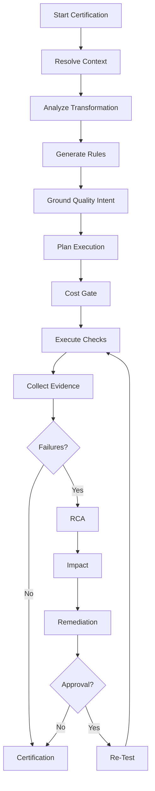

Temporal provides:

- durable state
- retries
- long-running workflow support
- human approval waiting
- recovery after process crash
- resumable workflows

---

# 34. Remediation Safety Model

Levels:

```text
LEVEL 0 — Observe
LEVEL 1 — Explain
LEVEL 2 — Recommend
LEVEL 3 — Generate Patch
LEVEL 4 — Human-Approved Execution
LEVEL 5 — Policy-Approved Autonomous Remediation
```

Initial platform default:

- recommendation
- patch generation
- controlled execution

Never allow an LLM to directly execute destructive database changes.

---

# 35. Root Cause Analysis

RCA should be evidence-driven.

Example:

```text
Failure:
FACT_REVENUE volume ↓ 14%

Evidence:
RAW_ORDERS normal
STG_ORDERS normal
INT_REVENUE ↓ 14%
FACT_REVENUE ↓ 14%

Transformation diff:
WHERE status = 'COMPLETE'

Approved business contract:
COMPLETE + SHIPPED

Reproduction:
Previous predicate restores expected aggregate
```

Claim:

```text
Root cause:
The fact_revenue transformation excludes SHIPPED transactions.

Status:
SUPPORTED
```

---

# 36. Impact Analysis

Traverse downstream lineage.

Example:

```text
FACT_REVENUE
    ↓
CUSTOMER_REVENUE
    ↓
EXECUTIVE_FINANCE_DATASET
    ↓
Revenue Dashboard
```

Return:

- affected datasets
- affected pipelines
- affected dbt models
- affected dashboards
- business concepts
- owners
- criticality

---

# 37. Incident Architecture

Suggested model:

```text
Incident
- id
- severity
- state
- dataset
- pipeline
- failed_rule
- evidence_bundle
- root_cause
- impacted_objects
- owner
- remediation
- certification_impact
- created_at
- resolved_at
```

Incident UI should provide:

- failed test
- evidence
- lineage
- RCA
- impact
- remediation
- timeline
- executed SQL
- cost
- rerun action

---

# 38. Certification Model

Certification states:

- CERTIFIED
- AT_RISK
- FAILED
- UNKNOWN

Certification is derived from:

- rule status
- rule severity
- quality contract
- freshness
- evidence
- completeness of required checks

Do not use arbitrary AI-generated confidence or scores.

---

# 39. Core Data Model

Suggested entities:

```text
Organization
User
Environment

Connection
DataPlatformConnection
PipelineConnection

BusinessDomain
BusinessConcept
BusinessDefinition
ContextSource
ContextObject
ContextRelationship

DataProduct
Dataset
Column
Transformation
Pipeline
PipelineTask

LineageNode
LineageEdge

QualityContract
QualityRule
QualityRuleVersion
ExecutionPolicy

QualityPlan
QualityRun
QualityRuleRun
Metric
ExceptionRecordReference

Evidence
EvidenceBundle
EvidenceRelationship

AgentRun
AgentClaim
ClaimEvidenceLink

Incident
RootCauseAnalysis
ImpactAnalysis
RemediationProposal

Certification
CertificationRule

CostEvent
CostEstimate
CostPolicy

Artifact
AuditEvent
```

---

# 40. Storage Architecture

## PostgreSQL

Store:

- configuration
- metadata
- rules
- contracts
- relationships
- runs
- evidence metadata
- claims
- incidents
- certifications
- costs
- audit

## pgvector

Use for:

- business definition retrieval
- documentation
- mapping search
- prior incident similarity
- contextual semantic retrieval

## Object storage

Store:

- dbt artifacts
- logs
- large evidence
- exception files
- profiles
- generated reports

## Redis

Use only for:

- cache
- rate limiting
- transient coordination

Do not use Redis as the durable source of workflow truth.

---

# 41. OpenLineage Architecture

Normalize lineage around:

- dataset
- job
- run
- input
- output

Integrate:

- Airflow
- dbt
- warehouse events where possible

Use OpenLineage-compatible identifiers internally even if the initial implementation reuses current lineage structures.

---

# 42. Security Architecture

## 42.1 Identity

Target:

- OIDC
- SAML
- enterprise SSO

## 42.2 Authorization

Support:

- organization-level isolation
- environment roles
- connection permissions
- agent tool permissions
- remediation permissions

## 42.3 Secrets

Never store unencrypted credentials in normal business tables.

Use:

- AWS Secrets Manager
- Azure Key Vault
- GCP Secret Manager
- HashiCorp Vault

## 42.4 Query safety

Default quality connections should be:

- read-only
- SELECT-only
- timeout-controlled
- row-limit controlled
- exception-limit controlled

## 42.5 Agent safety

Every agent tool must be allowlisted.

Example:

```text
Metadata Agent:
READ metadata
READ small samples

RCA Agent:
READ evidence
READ lineage
EXECUTE approved SELECT

Remediation Agent:
GENERATE patch
NO production deployment by default
```

---


# 43. Deployment Portability and Environment Agnosticism

Deployment portability is a **hard architectural requirement**, not an implementation convenience.

The application must support the same logical product architecture across three runtime patterns:

1. **Standalone Docker**
2. **Kubernetes**
3. **Cloud / Private VPC / Customer VPC**

Core business logic, agents, contracts, adapters, evidence models, quality rules, and APIs must remain unchanged across all three.

Only infrastructure bindings, service discovery, secrets providers, storage endpoints, networking, and scaling policies may differ.

## 43.1 Portability principle

```text
                SAME APPLICATION
                       │
          ┌────────────┼────────────┐
          │            │            │
          ▼            ▼            ▼
      DOCKER        KUBERNETES   CLOUD / VPC
    STANDALONE       CLUSTER       RUNTIME
```

The platform must not contain logic such as:

```python
if cloud == "aws":
    business_logic()
```

Cloud-specific behavior belongs behind infrastructure adapters.

## 43.2 Supported environment A — Standalone Docker

Primary uses:

- local development
- client demos
- proof of concept
- developer integration testing
- small self-hosted deployments

Reference topology:

```text
docker compose
   │
   ├── frontend
   ├── api
   ├── worker
   ├── postgres
   ├── redis
   ├── temporal optional
   ├── object-store-compatible service optional
   └── local dbt / Airflow integration
```

Requirements:

- no Kubernetes dependency
- no cloud-provider dependency
- environment-variable driven configuration
- local filesystem or S3-compatible object-storage option
- local PostgreSQL container
- local Redis container
- optional local Temporal
- optional embedded/demo Airflow mode
- DuckDB demo support

## 43.3 Supported environment B — Kubernetes

Primary uses:

- scalable enterprise runtime
- private platform deployment
- shared multi-team installation
- large-scale distributed workers

Reference topology:

```text
Kubernetes
   │
   ├── frontend Deployment
   ├── api Deployment
   ├── agent-worker Deployment
   ├── quality-worker Deployment
   ├── reconciliation-worker Deployment
   ├── Temporal workers
   ├── ingress / gateway
   ├── secrets integration
   ├── autoscaling
   └── observability
```

Support Kubernetes-compatible distributions including, where practical:

- upstream Kubernetes
- Amazon EKS
- Azure AKS
- Google GKE
- Red Hat OpenShift
- Rancher-managed Kubernetes
- private/on-prem Kubernetes

The platform must not require proprietary EKS, AKS, or GKE features for core execution.

## 43.4 Supported environment C — Cloud / VPC agnostic

The platform must run in:

- AWS
- Azure
- GCP
- private cloud
- customer-owned VPC/VNet
- on-prem/private data center with equivalent infrastructure

Cloud-specific services are optional implementations behind common interfaces.

Examples:

```text
ObjectStorage
    ├── Amazon S3
    ├── Azure Blob Storage
    ├── Google Cloud Storage
    └── MinIO / S3-compatible storage

SecretsProvider
    ├── AWS Secrets Manager
    ├── Azure Key Vault
    ├── GCP Secret Manager
    └── HashiCorp Vault

IdentityProvider
    ├── Entra ID
    ├── Okta
    ├── Auth0
    ├── Keycloak
    └── standards-compliant OIDC/SAML provider
```

No business-domain service may directly depend on a specific cloud SDK unless it is inside a provider adapter.

## 43.5 Infrastructure abstraction interfaces

Define provider-neutral interfaces such as:

```python
class ObjectStore(ABC):
    async def put(self, key, data): ...
    async def get(self, key): ...
    async def delete(self, key): ...
    async def signed_url(self, key): ...


class SecretsProvider(ABC):
    async def get_secret(self, ref): ...
    async def rotate_secret(self, ref): ...


class IdentityProvider(ABC):
    async def validate_token(self, token): ...
    async def resolve_principal(self, token): ...


class EventBus(ABC):
    async def publish(self, topic, event): ...
    async def subscribe(self, topic, handler): ...


class WorkflowBackend(ABC):
    async def start(self, workflow, payload): ...
    async def status(self, workflow_id): ...
```

Provider implementations may include:

```text
ObjectStore:
- S3ObjectStore
- AzureBlobObjectStore
- GCSObjectStore
- MinIOObjectStore
- LocalFileObjectStore

SecretsProvider:
- VaultSecretsProvider
- AWSSecretsProvider
- AzureKeyVaultProvider
- GCPSecretsProvider
- LocalDevSecretsProvider

EventBus:
- KafkaEventBus
- ManagedKafkaEventBus
- LocalInMemoryEventBus for development only
```

## 43.6 Configuration model

All environment-specific configuration must be externalized.

Support:

- environment variables
- `.env` for local development only
- Kubernetes ConfigMaps / Secrets
- Helm values
- Terraform variables
- external secret references

Application code must not contain:

- hard-coded hostnames
- cloud account IDs
- hard-coded regions
- absolute infrastructure paths
- cloud-provider-specific business rules

## 43.7 Packaging standard

Every independently deployable service must be packaged as an OCI-compatible image.

Images should be:

- immutable
- versioned
- minimal
- non-root where possible
- multi-architecture where practical
- environment-agnostic
- configuration-driven

Recommended images:

```text
ade-ui
ade-api
ade-agent-worker
ade-quality-worker
ade-reconciliation-worker
ade-metadata-worker
```

A single combined image may be used for the demo if necessary, but production boundaries should remain explicit.

## 43.8 Storage portability

Structured operational data:

```text
PostgreSQL-compatible database
```

Preferred default:

```text
PostgreSQL
```

No architecture should require a proprietary cloud database.

Object evidence:

```text
S3-compatible ObjectStore abstraction
```

Vector retrieval:

```text
PostgreSQL + pgvector
```

This ensures private-cloud and self-hosted deployments remain possible.

## 43.9 Network portability

The platform must support:

- public endpoints
- private endpoints
- VPC/VNet peering
- PrivateLink/private service connectivity patterns
- VPN
- on-prem routing
- customer-managed ingress
- service mesh where required

Networking should be configuration, not application logic.

## 43.10 Execution-plane portability

Execution workers must be deployable:

```text
centrally
OR
inside customer VPC
OR
inside customer Kubernetes
OR
as standalone Docker workers
```

The control plane communicates using secure authenticated APIs/workflow channels.

This allows raw customer data to remain within the customer's environment.

## 43.11 Deployment artifacts

The repository should eventually provide:

```text
deploy/
  docker/
    Dockerfile.*
    docker-compose.yml
    .env.example

  kubernetes/
    base/
    overlays/

  helm/
    ade-platform/

  terraform/
    modules/
      core/
      aws/
      azure/
      gcp/
      private/

  docs/
    DEPLOY_DOCKER.md
    DEPLOY_KUBERNETES.md
    DEPLOY_AWS.md
    DEPLOY_AZURE.md
    DEPLOY_GCP.md
    DEPLOY_PRIVATE_VPC.md
```

## 43.12 Portability acceptance criteria

Deployment portability is considered valid only when:

1. the application runs end-to-end using standalone Docker,
2. the same images run in Kubernetes,
3. Kubernetes deployment does not depend on one managed-cloud distribution,
4. cloud object storage can be swapped through configuration,
5. secrets provider can be swapped through configuration,
6. core APIs and business logic do not change by environment,
7. warehouse adapters work independently of hosting location,
8. customer execution workers can run remotely from the control plane,
9. no raw enterprise data is required to leave the execution environment,
10. deployment documentation clearly distinguishes local, Kubernetes, and cloud/VPC operation.

---

# 45. Control Plane vs Execution Plane


Target enterprise topology:

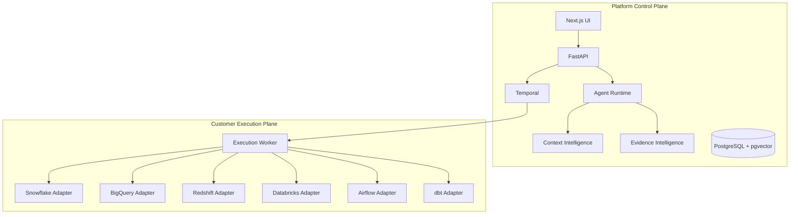

Customer data remains within the customer's environment wherever possible.

---

# 45. Deployment Models

The platform must support **three primary deployment environments** using the same OCI images and application code.

## 45.1 Standalone Docker

Best for:

- development
- demo
- POC
- small self-hosted installation

Typical topology:

```text
Docker / Docker Compose
  ├── UI
  ├── API
  ├── Workers
  ├── PostgreSQL
  ├── Redis
  └── optional Temporal / object store
```

## 45.2 Kubernetes

Best for:

- scalable production
- shared enterprise platform
- distributed worker execution
- autoscaling
- high availability

Must remain portable across:

```text
Upstream Kubernetes
EKS
AKS
GKE
OpenShift
Private Kubernetes
```

## 45.3 Cloud / Private VPC / Customer VPC

Best for:

- SaaS
- private SaaS
- regulated enterprise deployments
- customer-controlled network/data boundaries

Supported logical variants:

### Central SaaS control plane + customer execution plane

```text
Provider-neutral control plane
        │
        │ secure authenticated channel
        ▼
Customer VPC execution workers
        │
        ├── Snowflake
        ├── BigQuery
        ├── Redshift
        ├── Databricks
        ├── Airflow
        └── dbt
```

### Dedicated private SaaS

- dedicated deployment
- private networking
- isolated metadata plane
- client-specific security controls

### Fully customer-hosted

- control plane and workers inside customer infrastructure
- public cloud, private cloud, or on-premises

Cloud provider must remain a deployment choice, not a product dependency.

---

# 46. Observability Architecture

Instrument:

- API requests
- agent runs
- workflow runs
- adapter calls
- generated SQL
- query execution
- evidence collection
- reconciliation
- RCA
- remediation
- certification

Use:

- OpenTelemetry traces
- Prometheus metrics
- structured logs
- Grafana
- Sentry

Core metrics:

```text
quality_runs_total
quality_rules_executed
quality_failures
certifications
agent_calls_total
agent_cost
warehouse_queries
warehouse_bytes_scanned
reconciliation_runtime
evidence_objects_created
incidents_open
```

---

# 47. Frontend Information Architecture

Primary navigation:

```text
Control Tower
Data Products
Pipelines
Quality
Business Context
Contracts
Lineage
Incidents
Evidence
Agents
Certifications
Cost
Administration
```

## Control Tower

Answer:

- Which critical pipelines are healthy?
- Which data products are trusted?
- What failed?
- Which business rules failed?
- What changed?
- What is the root cause?
- What evidence supports the root cause?
- What should be fixed?
- What did testing cost?

## RCA view

Must surface:

- failed rule
- relevant business contract
- upstream lineage
- evidence
- code diff
- generated SQL
- source/target metrics
- RCA claim
- claim verification
- remediation proposal

---

# 48. UI Design Principles

Do not create a generic AI dashboard.

Avoid:

- excessive cards
- decorative gradients
- giant empty whitespace
- meaningless AI scores
- purple AI styling
- fake activity streams
- random sparkle icons
- oversized marketing hero panels

Prefer:

- dense enterprise tables
- strong hierarchy
- precise typography
- investigation workflows
- evidence drawers
- lineage exploration
- SQL inspection
- clear status labels
- cost visibility

---

# 49. Revenue Demo Reference Scenario

Business context:

```text
Net Revenue =
gross amount - discount - refund

Cancelled orders contribute zero.

COMPLETE and SHIPPED orders are recognized.

Source and target must reconcile.
```

Pipeline:

```text
Source Orders
   ↓
Airflow
   ↓
RAW_ORDERS
   ↓
dbt staging
   ↓
dbt intermediate
   ↓
FACT_REVENUE
   ↓
Revenue Data Product
```

Injected defect:

```sql
WHERE status = 'COMPLETE'
```

Expected:

```sql
WHERE status IN ('COMPLETE','SHIPPED')
```

Demo:

1. user selects Revenue,
2. Context Intelligence resolves contract and lineage,
3. agents propose checks,
4. deterministic SQL executes,
5. Airflow and dbt execute,
6. revenue reconciliation fails,
7. evidence is collected,
8. RCA identifies transformation defect,
9. remediation is generated,
10. controlled fix is applied,
11. tests rerun,
12. data product becomes CERTIFIED.

---

# 50. Quality Checks Required for Demo

Minimum:

- schema
- completeness
- uniqueness
- referential integrity
- freshness
- volume
- gross revenue reconciliation
- net revenue reconciliation
- cancelled order exclusion
- transformation formula
- source-target row coverage

---

# 51. Testing Architecture

## 50.1 Unit tests

Cover:

- rule model
- compiler
- context provenance
- evidence normalization
- grounding
- reconciliation
- hashing
- canonical normalization
- cost policies
- optimization planner
- transformation parsing
- certification

## 50.2 Adapter contract tests

Every DataPlatformAdapter must satisfy the same behavioral contract.

Every PipelineAdapter must satisfy the same behavioral contract.

## 50.3 Integration tests

Required:

- DuckDB
- dbt Core
- Airflow
- FastAPI
- quality execution
- evidence persistence
- RCA path

## 50.4 E2E

```text
context
→ generate checks
→ execute
→ fail
→ evidence
→ RCA
→ remediation
→ rerun
→ certify
```

## 50.5 Negative tests

Test:

- missing context
- contradictory evidence
- missing evidence
- invalid SQL
- cost-denied query
- adapter failure
- query timeout
- Airflow failure
- dbt failure
- malformed agent output

---

# 52. Scale Testing Strategy

Do not simulate terabytes by creating enormous local files.

Test planner behavior using synthetic metadata.

Examples:

```text
10M rows
→ direct SQL

300M rows
→ partition + aggregate

3B rows
→ bucket hash

20B rows
→ hierarchical hash

20TB estimated scan
→ DENIED
→ partitioned strategy selected
```

This validates architecture decisions without falsely claiming a real 20 TB benchmark.

---

# 53. Performance Controls

Every execution should support:

```text
timeout
maximum_bytes_scanned
maximum_exception_rows
full_scan_allowed
partition_filter_required
concurrency_limit
retry_policy
query_cancel
```

---

# 54. Failure Handling

Failure classes:

```text
CONNECTION_ERROR
SCHEMA_ERROR
QUERY_ERROR
TIMEOUT
PIPELINE_FAILURE
CONTRACT_FAILURE
QUALITY_FAILURE
COST_POLICY_DENIED
INSUFFICIENT_CONTEXT
INSUFFICIENT_EVIDENCE
AGENT_OUTPUT_INVALID
REMEDIATION_APPROVAL_REQUIRED
```

Failures must be persisted and visible.

---

# 55. Auditability

Audit:

- rule creation
- contract changes
- agent invocation
- evidence creation
- claim publication
- remediation proposal
- approval
- execution
- certification change
- connection changes
- policy changes

All critical decisions must be reconstructable.

---

# 56. Implementation Roadmap

## Phase 0 — Baseline audit

- verify existing v0.2
- document reusable assets
- preserve real dbt/Airflow capability

## Phase 1 — Domain architecture

Implement:

- business concepts
- contracts
- rules
- evidence
- claims
- incidents
- certification
- cost entities

## Phase 2 — Adapter abstraction

Refactor:

- DuckDB
- Snowflake
- Airflow
- dbt
- dbt Cloud

## Phase 3 — Quality Rule Engine

Implement canonical rules and deterministic SQL.

## Phase 4 — Context Intelligence

Implement structured context and provenance.

## Phase 5 — Transformation Intelligence

Implement SQLGlot parsing and transformation modeling.

## Phase 6 — Evidence Intelligence

Implement evidence normalization and claim links.

## Phase 7 — Agent loop

Implement:

- Context
- Transformation
- Quality
- Evidence
- RCA

## Phase 8 — Grounding Gateway

Enforce anti-hallucination rules.

## Phase 9 — Reconciliation

Implement:

- row count
- aggregate
- hash
- key coverage
- record drill-down

## Phase 10 — Cost / scale / optimization

Implement planner abstractions and policies.

## Phase 11 — Enterprise UI

Build Control Tower and investigation UX.

## Phase 12 — Demo certification

Make revenue scenario fully reproducible.

## Phase 13 — Production hardening

Add:

- PostgreSQL migration
- Temporal
- customer workers
- Kubernetes
- object storage
- OpenTelemetry
- enterprise identity
- secrets
- policy

---

# 57. Two-Day Demo Architecture

Do not attempt to fully deploy all target infrastructure in a two-day client demo.

## Must be real

- business context
- AI interpretation
- generated rules
- deterministic SQL
- dbt
- Airflow
- reconciliation
- evidence
- grounded RCA
- lineage
- remediation recommendation
- re-test
- certification

## Can remain architected / contract-tested

- full Kubernetes
- Kafka
- Neo4j
- production Temporal
- full SAML
- enterprise multi-tenancy
- autonomous remediation
- production-grade observability
- live BigQuery if no credentials
- live Redshift if no credentials
- live Databricks if no credentials

Use DuckDB as a fully functional local fallback.

Use Snowflake live if credentials are available.

---

# 58. Definition of Done

A credible end-to-end vertical slice must support:

1. start the platform,
2. discover or load pipeline metadata,
3. display business context,
4. generate quality contract/rules,
5. display generated SQL,
6. execute Airflow,
7. execute dbt,
8. execute SQL checks,
9. reconcile source and target,
10. detect a real failure,
11. collect actual evidence,
12. generate evidence-linked RCA,
13. display downstream impact,
14. generate remediation,
15. apply controlled fix,
16. rerun,
17. certify data product,
18. preserve full audit trail,
19. expose query and AI cost where available,
20. repeat reliably.

---

# 59. Architectural Invariants

The following rules must remain true as the system evolves.

1. **No agent action without context.**
2. **No material agent conclusion without evidence.**
3. **No production-changing action without policy.**
4. **AI defines quality intent; deterministic systems establish truth.**
5. **Move computation to the data.**
6. **Every material result must be reproducible.**
7. **Cost is part of planning.**
8. **Business and technical lineage share a common reasoning model.**
9. **Warehouses and orchestrators are adapters.**
10. **Never claim an integration is tested when it is only architected.**
11. **Never transfer massive datasets to the control plane for normal validation.**
12. **Previously certified data should not be unnecessarily rescanned.**
13. **Generated SQL must be inspectable.**
14. **Evidence and provenance must survive agent/provider changes.**
15. **The same application architecture must run in Docker, Kubernetes, and cloud/private-VPC deployments.**
16. **No core business logic may depend directly on AWS, Azure, GCP, EKS, AKS, or GKE.**
17. **Infrastructure-specific capabilities must be accessed through provider-neutral interfaces.**

---

# 60. Final Target Architecture

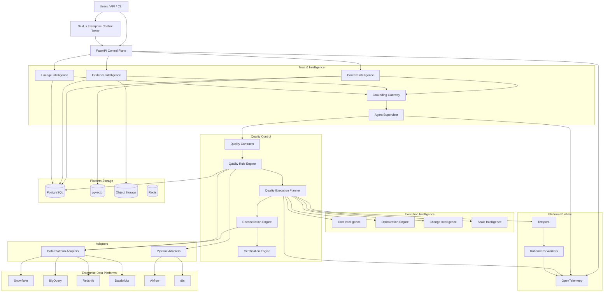

---

# 61. Closing Architecture Position

The final product is not a Python script that runs a collection of data-quality queries.

It is a **business-aware, evidence-grounded data reliability control plane**.

Its key architectural differentiators are:

- Context Intelligence
- Evidence Intelligence
- Claim/evidence grounding
- transformation intelligence
- business quality contracts
- deterministic quality rule execution
- source-to-target reconciliation
- pipeline correctness testing
- scale-aware execution planning
- cost intelligence
- optimization
- change-aware selective certification
- evidence-grounded root cause analysis
- impact analysis
- controlled remediation
- continuous certification

The platform can therefore support both the immediate client demonstration and a credible path toward large enterprise estates containing billions of rows and terabytes of data.

The architecture remains scalable because the control plane coordinates quality while the underlying warehouses and lakehouses perform the heavy computation close to the data.

It also remains portable because every core service is packaged as an OCI-compatible container and all infrastructure-specific behavior is isolated behind provider-neutral abstractions. The same product can therefore operate as a standalone Docker deployment, a Kubernetes deployment, or a cloud/private-VPC deployment across AWS, Azure, GCP, private cloud, and customer-controlled environments.
