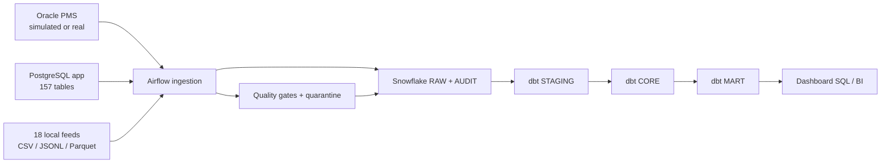

# Hospitality Snowflake Data Platform

A production-style portfolio implementation of an online hospitality reservation data platform. It models PMS operations, digital booking, payments, loyalty, restaurant/spa/events, housekeeping, maintenance, clickstream, marketing, and operational analytics without using real PII.

## Architecture



The source catalogs currently define **144 Oracle tables** and **157 PostgreSQL tables**. Airflow exposes the **40 required ingestion DAGs** plus **6 orchestration DAGs**. dbt includes **41 SQL models** and **4 SCD snapshots** in the first implemented slice.

## Quick start

Prerequisites: Docker Compose, Python 3.11+, and a Snowflake account for cloud loading.

```bash
cp .env.example .env
make setup
make generate-smoke
make test
make start
```

Before starting Docker services, set `POSTGRES_PASSWORD`, `AIRFLOW_SECRET_KEY`, `AIRFLOW_ADMIN_PASSWORD`, `AIRFLOW_METADATA_DB_URL`, and `AIRFLOW_CONN_POSTGRES_HOSPITALITY` in the untracked `.env` file. Open Airflow at [http://localhost:8080](http://localhost:8080) with the local admin user/password you configured there.

To connect Snowflake, execute `scripts/setup_snowflake.sql` with SnowSQL from the repository root, copy `dbt/profiles.yml.example` to `dbt/profiles.yml`, populate `.env`, and create an Airflow connection named `snowflake_hospitality`. Missing source artifacts or cloud credentials cause an explicit task failure; the project does not manufacture successful load states.

```bash
snowsql -c YOUR_CONNECTION -f scripts/setup_snowflake.sql
make dbt-run
make dbt-test
```

## Data generation

All data is deterministic and synthetic. Generators stream rows to disk and deliberately add invalid timestamps, null business keys, duplicates, soft deletes, cancellations, and late arrivals.

```bash
make generate-smoke   # 10 relational rows/table and 100 rows/file for development
make generate-small   # portfolio demo scale
make generate-medium  # tens of millions of events
make generate-large   # multi-GB / stress scale; ensure sufficient disk space
```

The 18 local feeds include clickstream and mobile events, partner bookings, rate shops, settlements, call-center/review exports, marketing and loyalty events, weather, local events, POS feeds, IoT maintenance events, and housekeeping inspections. `manifest.json` captures the seed, quality-case rates, and exact output counts.

Oracle has two supported modes:

- `ORACLE_MODE=simulated` uses Oracle-style DDL plus generated JSONL CDC exports. This is the default local mode.
- Real Oracle mode uses the same logical catalog and can be connected through the Airflow Oracle provider. Credentials remain environment-managed; no Oracle image is forced into the local stack.

## Warehouse layers

| Layer | Purpose |
|---|---|
| `RAW` | Immutable VARIANT landing records, internal stage, rejected records |
| `STAGING` | Typed, deduplicated, soft-delete-aware dbt models |
| `CORE` | Conformed dimensions, facts, and SCD snapshots |
| `MART` | Executive, occupancy, guest, funnel, payment, and operations marts |
| `AUDIT` | Batches, loads, watermarks, quality results, pipeline errors, dbt runs |
| `UTIL` | Shared future utilities and procedures |

The raw contract always retains source lineage, batch ID, ingestion timestamps, record hash, payload, and deletion state. Timestamp/high-watermark jobs use a 72-hour dbt lookback to absorb late records, then merge on stable business keys. Append-only feeds deduplicate by business key or record hash. SCD2 attributes use dbt snapshots.

## Orchestration

The ingestion factory gives every job the same governed lifecycle:

```text
start → batch ID → extract/discover → schema/artifact validation
      → stage + COPY → load audit → quality gate → finish
```

TaskGroups keep extraction, validation, load, audit, and quality concerns visible. The daily master triggers jobs by source; the end-to-end DAG then runs staging, core, marts, and tests in order. See [docs/airflow_jobs.md](docs/airflow_jobs.md).

## dbt and data quality

Shared macros implement surrogate keys, timestamp/boolean normalization, safe numeric casts, record hashes, audit columns, and raw deduplication. Implemented tests cover keys, relationships, accepted reservation states, date ordering, non-negative payments, occupancy bounds, cancellation bounds, and conversion bounds.

Pre-load validation checks existence, size, required metadata, timestamps, null keys, and sampled duplicates. Snowflake provides `RAW.REJECTED_RECORDS` plus audit tables for rejected rows and check outcomes.

```bash
make quality
make dbt-docs
```

## Analytics

The `dashboards/` directory contains 11 ready-to-adapt Snowflake queries for executive KPIs, occupancy, property revenue, guest 360, conversion, reconciliation, loyalty, housekeeping, maintenance, marketing, and cancellation analysis.

## Repository map

```text
airflow/         dynamic ingestion and orchestration DAGs
data_generator/ deterministic file and relational export generators
dbt/             sources, staging, intermediate, core, marts, tests, snapshots
snowflake/       database, warehouse, stage, audit, stream, and role DDL
sources/         physical Oracle/PostgreSQL DDL and generated local feeds
quality/         streaming pre-ingestion validation
dashboards/      analyst-facing KPI queries
docs/            architecture, models, operations, and implementation roadmap
tests/           fast local inventory and generator tests
```

## Useful commands

`make setup`, `make source-ddl`, `make generate-{small,medium,large}`, `make start`, `make airflow`, `make ingest`, `make dbt-run`, `make dbt-test`, `make dbt-docs`, `make quality`, `make demo`, `make stop`, and `make clean` are supported. `make clean` removes local containers, volumes, and generated data, so use it intentionally.

## Current implementation boundary

The repository contains the deterministic local proving ground, full source catalogs, required DAG inventory, multi-scale synthetic feeds, Snowflake landing/audit controls, dbt transformation layers, quality/reconciliation evidence, and operator-facing tests used by the platform acceptance suite. Live Oracle/PostgreSQL/Snowflake/cloud execution remains credential- and service-dependent and is reported explicitly rather than represented as local success.

