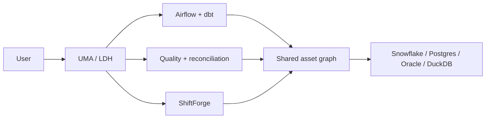

# Master architecture

The program keeps three modular systems: UMA/LDH reasons and operates,
ShiftForge migrates and validates, and hospitality is the reference workload.
All platform facts flow through deterministic tools.

The root registry is the policy boundary. Analyst and Plan are read-only;
Builder is required for mutation-risk operations and production approvals.
Snowflake-free local simulation is an explicit mode, never a live-success claim.
